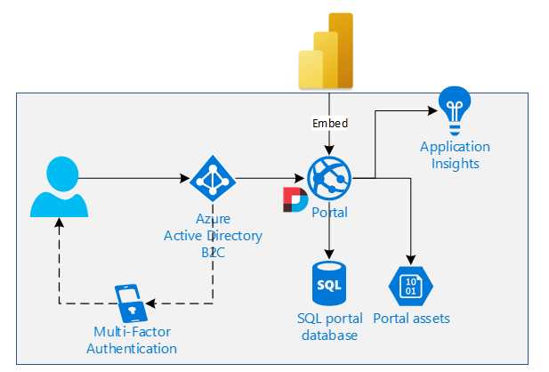

[](https://github.com/intelequia/dnn.powerbiembedded/releases) [](https://intelequia.visualstudio.com/DotNetNuke.PowerBI/_build/latest?definitionId=44)

# DNN PowerBI Embedded module

A set of modules to embed PowerBI Embedded dashboards and reports into a DNN Platform installation.

# Introduction

In business environments where you need to offer a business intelligence solution based on data, dashboards and reports, one of the first tools that comes to mind is [PowerBI](https://powerbi.microsoft.com/). Then you realize that you would like those reports to be available embedded within your own application instead of having to license all users because of permissions and sharing restrictions.

It gets even more interesting when your application is used by thousands of users outside your organization. That's where [PowerBI Embedded](https://powerbi.microsoft.com/en-us/power-bi-embedded/) comes into play. A service that allows you to publish PowerBI portal resources under your premises, being able to fully customize the user experience.

The DNN PowerBI Embedded module allows you to embed PowerBI reports and dashboards into your DNN website and secure the access to the reports by using DNN users and roles, including role security level and lots of rich features without the need of coding the PowerBI Embedded integration. 

## Resources
* DEMO VIDEO: For a quick overview, check this [demo video](https://www.youtube.com/watch?v=kZzKFqyt88w). 
* Documentation: for the full project documentation, please refer the [Wiki](https://github.com/intelequia/dnn.powerbiembedded/wiki)




# Building the solution
### Requirements
* Visual Studio 2019 or later (download from https://www.visualstudio.com/downloads/)
* npm package manager (download from https://www.npmjs.com/get-npm)

### Configure local npm to use the DNN public repository
From the command line, the following command must be executed:
```
   npm config set registry https://www.myget.org/F/dnn-software-public/npm/
```
### Install package dependencies
From the command line, enter the `<RepoRoot>\DotNetNuke.PowerBI\PBIEmbedded.Web` and run the following commands:
```
  npm install -g webpack
  npm install -g webpack-cli
  npm install
```

### Build the module
Now you can build the solution by opening the file `DotNetNuke.PowerBI.sln` in Visual Studio. Building the solution in "Release", will generate the React bundle and package it all together with the installation zip file, created under the "\releases" folder.
